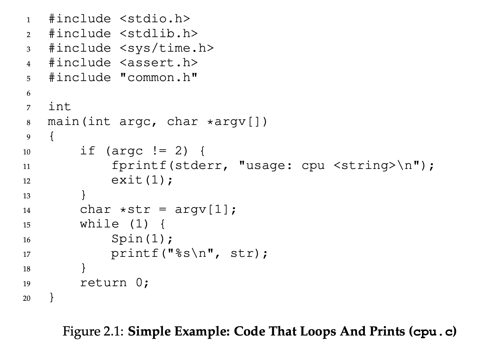
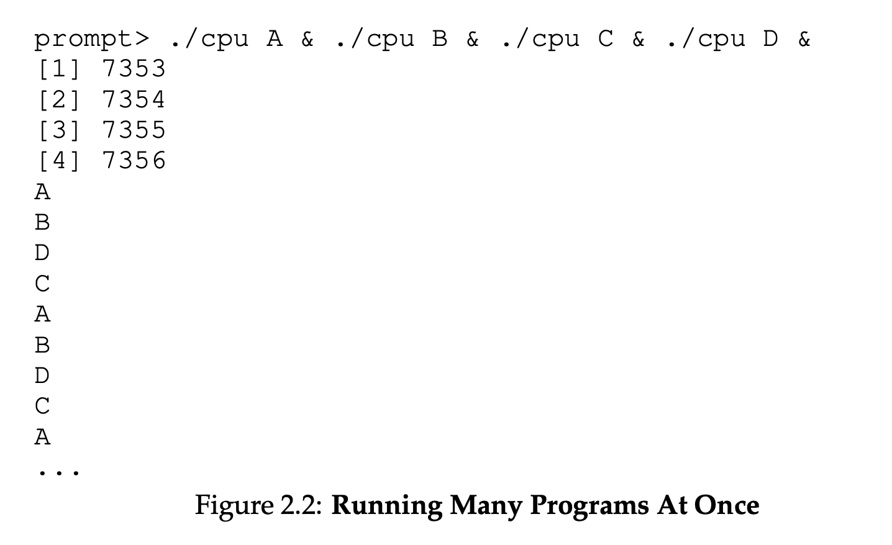
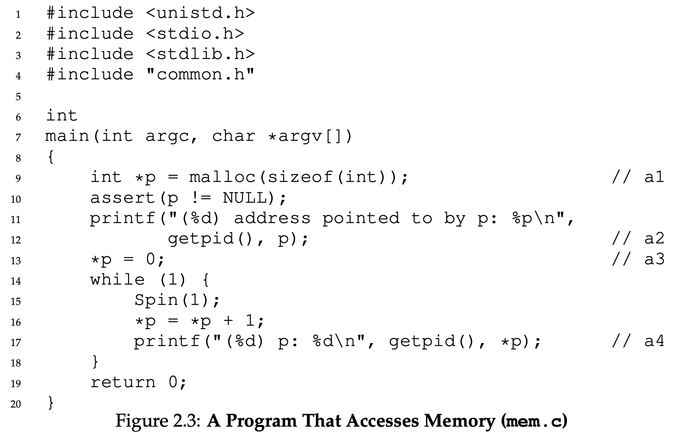
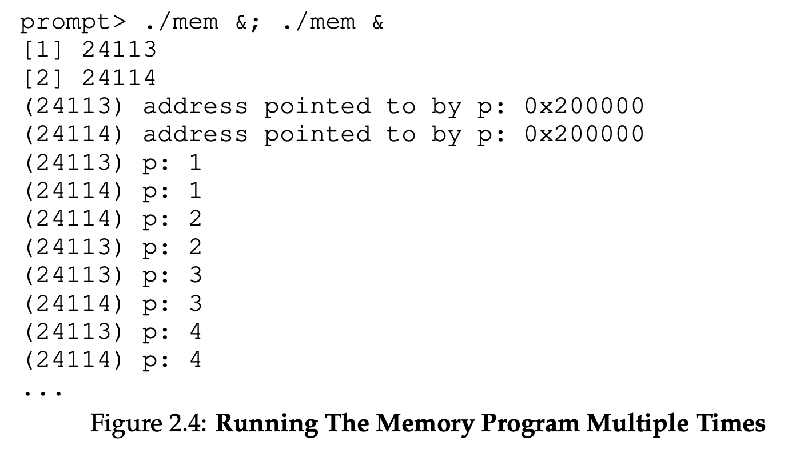

# Chapter 2 Notes

## What is the Von Neumann model of computing?

A running program executes instructions: **fetches** instructions from memory, **decodes** it, and **executes** it. Jump to next instruction. Repeat. Modern processors do a myriad of frightening things underneath the surface. This describes a simple model most programs assume. 

While this is a simple view, we learn several things happen with the primary goal of making the program **easy to use**. The **Operating System** is the software which is responsible for facilitating program execution: allowing programs to share memory, enabling programs to interact with devices, and run programs concurrently. It's duty is to assure programs operate correctly, and efficiently in a easy to use manner.

OS achieves optimal performance through **virtualization** - transforming a **physical** resource (processor, disk, memory) into more general, powerful, easy-to-use **virtual** form of itself. So OS is referred to as **virtual machine**.

OS provides dozens of API's so users can interact with system (program execution, file access, memory allocation). A typical OS exports a few hundred **system calls** which are available to applications. Because the OS provides these calls to run programs, we (sometimes) say OS provides a **standard library** to applications.

OS applies virtualization to enable many programs to run, each concurrently accessing their own instructions, data, and devices. Each CPU, memory, disk is a resource of the system. It's the OS's responsibility to manage resources *efficiently* and *fairly* alongside other goals. Thus, OS is known as a **resource manager**.

## 2.1 Virtualizing the CPU

The above program calls `Spin()` which repeatedly checks the time, and returns after 1 second. Then program prints out user passed in `String`. These two steps repeat forever. Its uninteresting, though runnning forever. `CTRL + C` will halt the program on Unix-based systems.

Let's run different instances of this same program. Even though we have 

Even though we only have 1 processor, all 4 seem to run simultaneously. **Why does this happen?**

- OS creates an **illusion** that system has a seemingly infinite amount of virtual CPU's, enabling multiple instances of `cpu.c` to run. This process virtualizes a physical resource. We call this **virtualizing the CPU**, the focus of the first major part of this book.

The ability to run multiple programs att once raises questions.
1. What if two programs want to run at a particular time? Which should run?
    - The **policy** of the OS answers this. We study these poilicies to understand the basic **mechanisms** (multiple program execution) OS implements. OS is truly a **resource manager**.

## 2.2 Virtualizing Memory

The model of **physical memory** is simple, an array of bytes. One specifies an **address** to **read** the memory. Additionally, he specifies any data to **write** memory at the given address.

Memory is accessed often during program exection. A program stores all data structures in memory, accessing them through instructions—loads ands stores—or other explicit instructions requiring memory access. Since each instruction is in memory, instruction fetches access memory.

The output of the program is:

The single instance program result is uninteresting: It allocates new memory at 0x200000, slowly updating the value and printing. When running multiple instances, each program allocated memory at 0x200000 indpendently. Each memory seems to share its own private memory, in place of physical memory.

The OS is **virtualizing** memory. Each process accessess its allocated private **virtual address space**, which OS maps onto physical memory of machine. To a program, these address spaces of a program don't conflict with those of other programs. In truth, physical memory is a shared resource managed by OS. 

