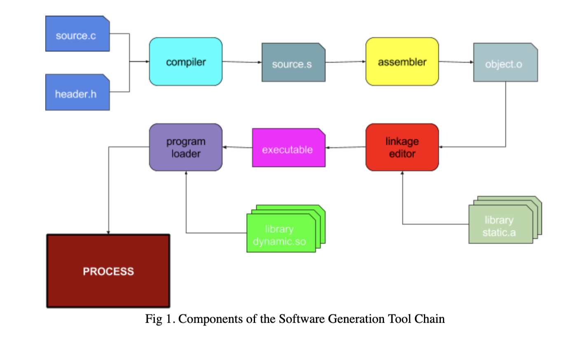
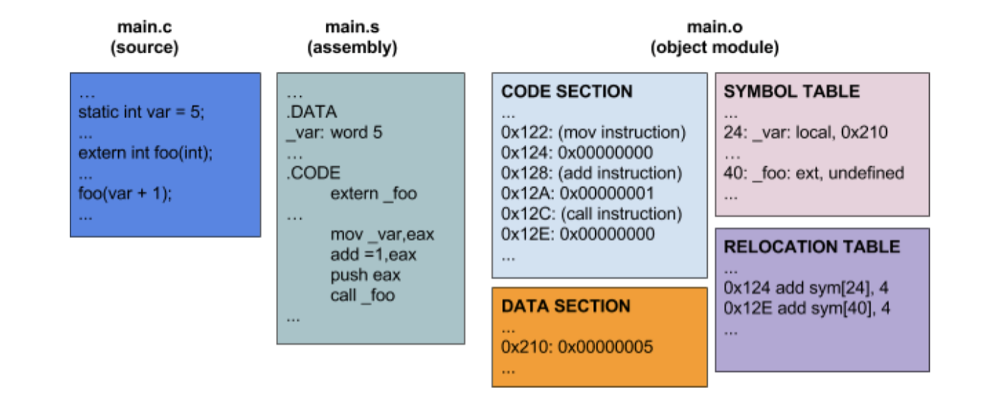
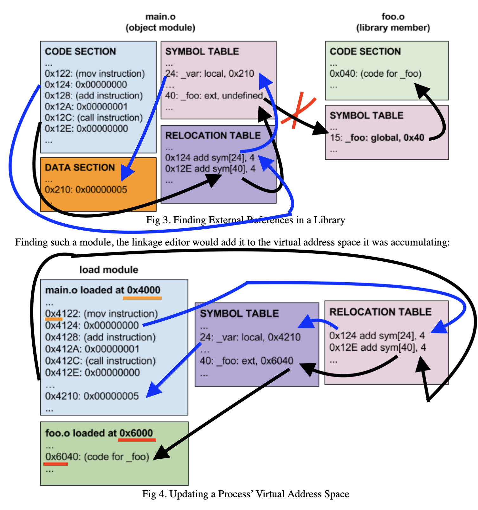
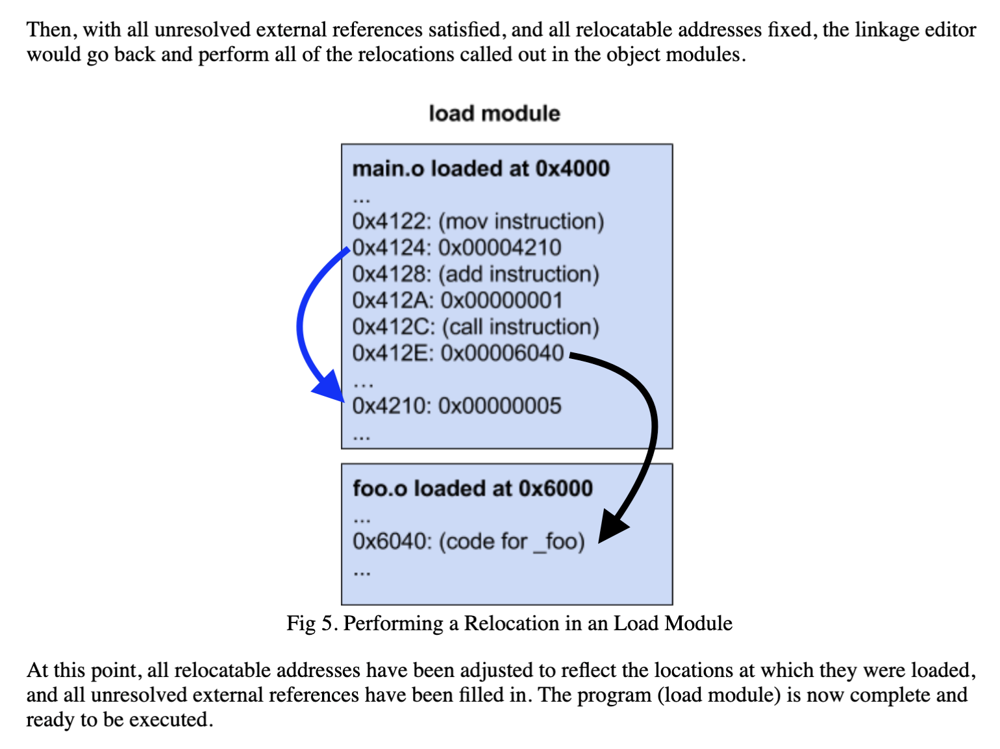
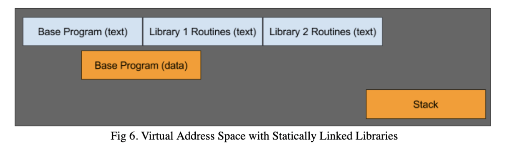
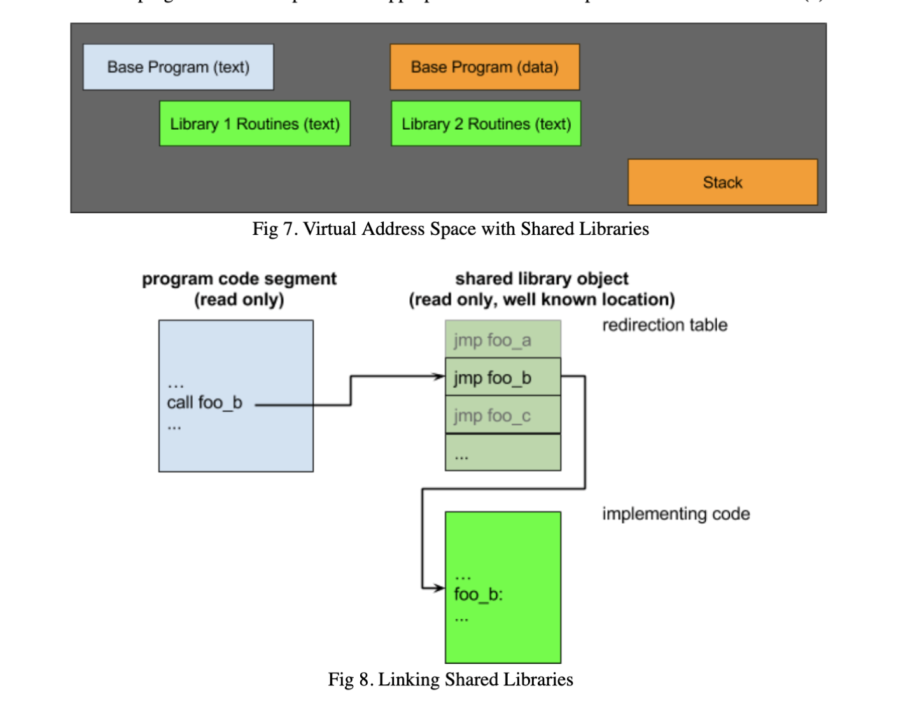

# Object Modules, Linkage Editing, Libraries

## Introduction

One of the most fundamental abstract resources implemented by OS is the ***`process`***, which is a executing instance of a program. To understand a process, we need to understand programs. We think they are one or more files, not executable programs, but source files translated into machine language, combined with other machine language modules to create executable programs.

From the OS perspective, a program is 1's and 0's that become machine-language ~~instructions~~ instructions when loaded into. This raises questions such as:

1. How do source modules become translated in to mahcine language instructions?
2. How do source modules combine with machine lanugage moduels to form complete program?
3. What is the format of files that contain executable programs? How is it correctly loaded into memory?

## The Software Generation Tool Chain

We divide the files that represent programs into few general classes:

1. ***Source Modules*** - editable text in some langauge translated into machine language by compilter or assembler
2. ***Relocatable Object Modules*** - sets of compiled instructions created from individual source modules, which aren't complete programs.
3. ***Libraries*** - collections of object modules, from which we fetch functions required by original source object modules.
4. ***Load modules*** complete programs ready to be loaded into memory and executed by CPU

This figure shows typical software generation tool chain. Rounded boxs represent software tools, and rectangle boxes with one corner cut off represent files used (and created) during process. Large rectangle is the the final result, a process the OS schedules and runs.

Consider the order these components are used:

1. Compiler - Reads source modules and header files. Parses input langauge. **Infers intended computations for which it generates lower level code. This code is produces in assembly language, instead of machine language.** Assembly langauge provides greater flexibility for further processing, increased portability, and simplifies the compiler by delaying further processing work to a subsequent phase. There are langauges (Java, Python) whos compilers produce a pseudo-machine langauge executed by a virtual machine.

2. Assembler - A much lower level, each line translating directly into single machine langauge instruction or data item. Assembly langauge allows declaration of variables, macros, references to externally defined code and data. Developers write assembly language routines for code compiler incapable of generating.
    1. In user mode code, modules writen in assembler are:
        - perfomance critical string and data struct manipulations
        - routines to implement calls into the OS

    2. In operating system, modules written in assembler include:
        - CPU initialization
        - first level trap handlers
        - synchronization operations

    3. **The output of assembler is an object module of mostly machine code.** Because output corresponds to a single input module for the linkage editor.
        - some functions aren't present, so addressess are unfilled.
        - locally defined symbols may not be assigned hard in-memory addresses, then expressed as offsets relative to a to-be-decided starting point.

3. Linkage Editor - Even lower, reads specified set of object modules, placing them consecutively into a virtual address space, noting where each was placed. It notes unresovled external references (to symbols referenced by, but not defined by loaded object modules). Searches a specified set of libarires to satisfy references, placing them into evolving virutal address space. Finds ever reference to relocatable or external symbol, updating TBD decided adddresses from assembler in to where desired code was actually placed.
    1. **Linkage editor produces a program ready to be loaded into memory and executed, written out to a new file, called *executable load module*.**

4. Program Loader - Program loaded is part of OS. **Examines information in a load module, creates appropriate virtual address space. Reads instructions. Initiualizes data values from load module into the virtual address space.** Program loader resolved references to shared libarires, mapping them into appropriate places in virtual address space.

Once the virtual address space is created, required code copied into virtual memory, program executed by CPU. Yay!

## Object Modules

While a program must be complete, in a single file, before loaded into memory and executed, we don't put all of the code that's executed into a single file.

1. Single file containing everything is collassal, difficult to understand, cumberson to update. COde is understandable, maintanable, if different functionality broken into independent modules.
2. Many functinos are commonly used. Making modules available for re use (from externally supplied libraries) reduces work associated with writing new programs.

Most programs written by combining modules together. Program fragments are called *relocatable object modules*. They differ from load modules in two interesting aspects:

1. they make references to code supplied from external modules, so its incomplete.
2. they aren't combined together to make a program, so its undetermined where these modules are placed into memory. References to code within the same module can only have one relative (to the start of the module) address.

Machine language instructions within object modules are Instruction Set Architecture specific. The pattern of 1's and 0's on Intel Pentium is different than ARM or PowerPC. It's surprising to learn many contemporary object module formats are common across many Instruction Set Architecture. A popular format for Linux is ELF (Executable and Linkable Format). An ELF format is divide into multiple consecutive sections.

- ***`Header section`*** - describe types, sizes, locations of other sections
- ***`Code and Data sections`*** - contains bytes of code to be loaded
- ***`Symbol Table`*** - lists external symboles defined or needed by this module
- A collection a ***`Relocation Entry`*** - describes the
    - location of field (in code) that requires relocation
    - width/type (32 or 64 bit address) of field to be relocation
    - symbol table entry, whos address should be used to perform the relocation

## Libraries

In addition to its own modules, an interesting program uses hundreds, thousands of re usable functions. Specifying which of thousands to be included in extremely inefficient, awkward. This problem is solved with creating libraries of useful functions, A ***`library`*** is a collection of usually related object modules. One library contains standard system calls, while others contain common math functions. While reusable code is often distributed through libraries, not all libraries are public collections of reusable code. If I write a program of hundreds of modules, I'll organize it into 1 or more libraries. There are different operating systems, that implement libraries differently, but the **concept of packaging groups of related modules together is common amongst software development tool chains**.

Linux command to create, update, and examine libraries is `ar`.

Building a program starts by comibining groups of enumerated object modules constituing the program, whos comibined result will contains unresolved external references. Then, we search a list of enumerated libraries to find modules that contain required functions.

Libraries are not always orthogonal, and independent:
- It's common to implement higher level libraries using functionality from lower level libraries.
- It's 'fairly' common to use alternative implementations for library functionality to intercept calls to standard functions to collect usage data.

If libraries are not orthogonal and indepdendent, the order of libraries searched is very important. Supposed a function in library A cals functions from library B. We must search library A, before library B. To override the standard `malloc` with valgrind's more powerful diagnostic version, we search valgrind library before standard C library.

## Linkage Editing

Linkage Editing is composed of three steps. All pre-executable programs must undergo this to become a program:

1. ***Resolution*** - search specified libraries to find object modules to satisfy all unresovled external references
2. ***Loading*** - align all text and data segments from object modules into a single virtual address space.
3. ***Relocation*** - iterate through relocation entires in all loaded object modules, correctly reflecting the chosen addresses.

All the links between loaded modules are filled in so it's called `Linkage Editing`. A linkage editor performs this process. The command to trigger linkage editing in Linux is 
`ld`. 

## Load Modules

A load module is similar to an object module as both contain multiple sections (code, data, symbols). A load module differes from an object module:
1. It's complete
2. requires no relocation. Each section specifies the address at which it should be loaded.

When the OS is instructed to load a new program, it:
1. consults the load module to determine required text and data size and locations.
2. allocates appropirate sections in virtual address space.
3. reads text and data segements into memory
4. creates stack segment, initializing stack pointer to start.

The program is ready to execute. OS transforms control to entry point (specified in load module).
Why does load module contain symbol table if no relocation necessary?
1. To help debugging. If an exception occurs, symbol enables where (12 bytes into foo routine) it occured. Most load modules don't contain symbol tables, and others do, to assist intelligent debuggers.

## Static vs Shared Libraries

In the above linkage editing process, library modules were **permanently** incorporated into the load module.

Because of the permanence, this process is referred as ***`static linking`***. The disadvantages of static linking are:
1. Many libraries are used by every program on the system. Thousands of identical code copies increase
- load time.
- disk space used.
- start up time (to read into memory).
- memory used (while executing).
It's more efficient allowing programs to share a single copy of a popular library.

2. Popular libraries evolve over time with enhancements, optimization, and bug fixes. In most cases, a newer version, better than the last one should be accessible to all programs using the library. With static linking, each program has a frpzen version of each library at time program was linkage edited. It's better it possible to automatically load the latest library versions each time program was started.

These disadvantages are addressed by run-time loadable, shared libraries. A simple way to implement shared libraries is:

1. Reserve address for each shared library, easy to do in 64 bit architecture, possible in 32 bit.
2. Linkage edit shared libraries into read-only segments, loaded at address reserved for library.
3. Assign number to each routine. Create a redirection table at beginning of shared segment, 
containing the addresses of each routine in the shared library to be filled in by linkage editor. Does the redirection table map a number to an address?
4. Create a stub libary, defining symbols for every entry point in the shared library. Each stub library is a branch through the appropriate entry in the redirection table. The stub library includes symbol table info, informing the OS what shared library segment program requires.
4. Linkage edit client program with sub library.
5. When OS loads program into memory, it notices need for shared libraries, mapping associated (shared, read only) code segments into program's virtual address space.

In this way:
1. A single copy of the shared library implementation shared among all programs that use the library.
2. Version of the shared segment mapped into virtual address space chosen, during program load time. The choice of which version controlled by a library path environment variable.
3. Client programs unaffected by changes to library since calls between client program and shared library vetored through a table.
4. With correct coding of stub modules, one shared library can make calls to another.

## Dynamically Loaded Libraries

Shared Libraries powerful, but proved to be too limiting for applications:
1. There are large libraries seldom used. Loading libraries into address space (unecessarily) slows program, increasing memory footprint. It's prefereable to delay loading until actually needed.
2. While loading is delayed until program load time, name of library to be loaded must be known at linkage editing time. There are situations where extensions are designed and delivered independently from the client that exploits them.

These lead to DLL's: libraries that aren't loaded until actually needed. The general model is:
1. Application chooses library to be loaded based on run-time information.
2. Application asks OS to load library into address space.
3. OS returns addresses of few standard entry points.
4. Application calls supplied initialization entry point, binding application and DLL.
5. Application requests services from DLL. It makes calls through vector of service entry points.
6. Applcation calls shut down method when need of DLL is gone.

The Linux support for user mode DLL's is in dlopen. **DLL's allow pre-compiled applications to exploit plug-ins to support functionality that wasn't implemented at the time original application was built. Powerful.

Calls from client application into a DLL handled through vectory of entry points. There's more diversity in handling of calls from library back into application.
1. Application registers call-back routine passing its address into appropriate library.
2. Same approach generalizsed to large number of functions having the application call library to register vectory of entry points to perform standard functions.
3. Dynamically loaded kernel modules access functions + data structures within kernel they're loaded in. It's enabled by run-time loader effectively linkage editing newly loaded module against OS, filling in addresses of all unresolved external references from dynamically loaded module in OS.

## Implicitly Loaded Dynamically Loaded Libraries

Dynamically Loaded Library implementations are similar to shared libraries.
1. Applications are linkage edited against set of stubs, which create Program Linkage Table entries in client load module.
2. PLT entries are initialized to point calls to a Run-Time Loader.
3. First time these entry points called, sub calls Run-Time Loader to open and load appropriate DLL's.
4. After required library loaded, PLT entry changes to point towards appropriate routine in newly loaded library. After that, PLT entry goes directly into now-loaded routine.

Such implicitly loaded DLL's are indistringuishable from statically loaded libraries or shared libraries. DLL's reduce size of load modules, allowing a single on disk/ code to be shared concurrently among running programs.

The greater functionality and benefits of Dynamically Loaded Libraries available when client applications become aware:
1. Shared libraries allow delayed binding to some version of a library chosen at linkage run-time. DLL's allow library to be loaded at chosen run time.
2. Shared libraries consume memory for the entire time process runs. DLL's unlaoded when no longer needed. DLL's can be unloaded when no longer needed.
3. Shared libraries impose numerous constraints on similar interfaces on code they contain. DLL's can perform complex initialization and supporting bidirectional calls between client and library.
4. Shared libraries are indistinguishable from statically loaded libraries, and simple to use. DLL's require considerably more work to register interface and establish work sessions.

Shared Libraries are more efficient. DLL's are a mechanism to dynamically extend functionality of a client appication based on resources not available until moment they're needed.